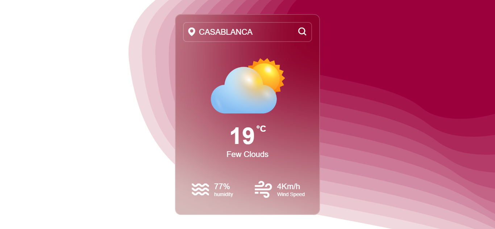

# Weather App

Welcome to the Weather App! This application allows users to check the current weather and forecasts for locations worldwide. Built with Sass, React.js and vite for the local development, it offers an intuitive and visually appealing interface for accessing weather information.



## Features

- **Location-based Weather**: Enter any location to view its current weather conditions and a forecast for the upcoming days.
- **Responsive Design**: Enjoy a seamless experience across various devices, including desktops, tablets, and smartphones.
- **User-friendly Interface**: Intuitive design and smooth transitions make it easy to navigate and access weather information.
- **Accurate Data**: Powered by a reliable weather API, the app provides up-to-date and accurate weather forecasts.

## Installation

To run the Weather App locally on your machine, follow these steps:

1. Clone the repository:

    ```bash
    git clone https://github.com/johanLib/weather-app.git
    ```

2. Navigate into the project directory:

    ```bash
    cd weather-app
    ```

3. Install dependencies:

    ```bash
    npm install
    ```

4. Start the development server(vite):

    ```bash
    npm run dev
    ```

5. Open your web browser and go to `http://localhost:5173` to view the app.

## Technologies Used

- **React.js**: A JavaScript library for building user interfaces.
- **Sass**: A preprocessor scripting language that is interpreted or compiled into Cascading Style Sheets (CSS).
- **Weather API**: Integrate a weather API to fetch weather data for different locations.
- **ViteJs**: for the local development.
